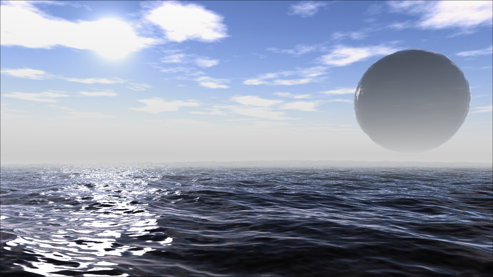

# WebTide

[](https://github.com/BarthPaleologue/babylonjs-template/actions/workflows/webpack.yml)



Ocean simulation based on Tessendorf's paper, implemented on WebGPU with BabylonJS.

This was my final project for the INF585 "Computer Animation" course at École Polytechnique.

An online demo is available [here](https://barthpaleologue.github.io/WebTide/).

## Features

- GPU-based FFT
- Phillips spectrum
- Wave vertices vertical displacement
- Choppy waves (waves vertices horizontal displacement)
- Physically based ocean shading
- Wrapping on a sphere with triplanar mapping

## How to use

Using the ocean in your own project is straightforward:

```ts
const textureSize = 512;
const tileScale = 1000;

const initialSpectrum = new PhillipsSpectrum(textureSize, tileScale, engine);
const waterMaterial = new WaterMaterial("waterMaterial", initialSpectrum, scene);

const water = MeshBuilder.CreateGround(
    "water",
    {
        width: 10,
        height: 10,
        subdivisions: textureSize
    },
    scene
);
water.material = waterMaterial;
```

You can have a look at the code in `src/ts/minimal.ts` for the simplest example possible.

## Related works

I made this simulation using many different resources found online:

- [Simulating Ocean Water](https://people.computing.clemson.edu/~jtessen/reports/papers_files/coursenotes2004.pdf) by Jerry Tessendorf

- GPU-based FFT from [BabylonJS Ocean Demo](https://github.com/Popov72/OceanDemo) by Popov72

- Nice specular coefficients from [Shadertoy](https://www.shadertoy.com/view/MdXyzX) by afl_ext

- Acerola's excellent [video breakdown](https://www.youtube.com/watch?v=yPfagLeUa7k) of Tessendorf's paper

- [Tangent calculations](https://fileadmin.cs.lth.se/cs/Education/EDAF80/seminars/2022/sem_4.pdf) by Rikard Olajos

## Build

```
npm run build
```

or

```
yarn build
```

to bundle your application
